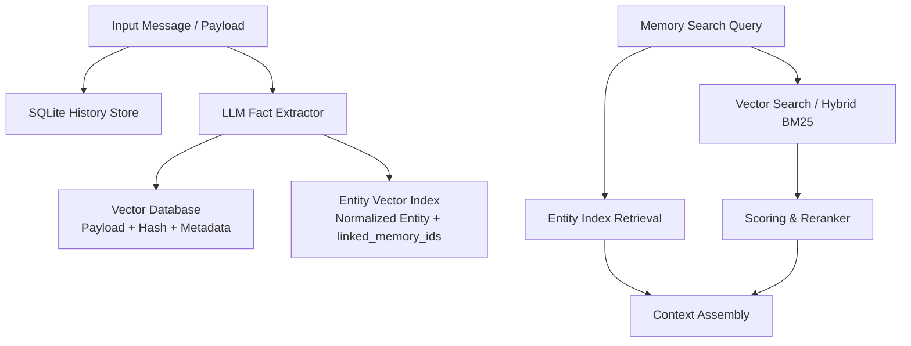

# Mem0

## Problem

Agents need persistent memory across sessions without blowing past LLM context windows or re-reading raw transcript histories on every turn. Mem0 addresses this by capturing conversational messages, extracting discrete fact statements via an LLM, storing extracted fact payloads in the configured vector store, and keeping normalized entity text/type plus `linked_memory_ids` in a separate entity vector collection.

## Snapshot

- **Repository**: [`mem0ai/mem0`](https://github.com/mem0ai/mem0)
- **Stars / snapshot date**: 61,615 stars (2026-07-24 snapshot)
- **Pinned commit**: [`d653b63fac6c8ad0ad84aead0912b366e705d269`](https://github.com/mem0ai/mem0/commit/d653b63fac6c8ad0ad84aead0912b366e705d269)
- **Latest published release**: `v2.0.13` (`2026-07-22`)

## Architecture

Mem0 operates as a memory extraction, indexing, and retrieval engine. It accepts text or chat payloads and separates memory management into four layers: raw chat history in SQLite, extracted semantic facts (vector storage), entity index structures (vector storage), and metadata filtering.

### Capture

Mem0's entry point is `Memory.add()`. It accepts optional scope parameters (`user_id`, `agent_id`, or `run_id`) alongside raw text or structured message lists. The raw conversation is saved to an internal SQLite message history store. Concurrently, an LLM call analyzes the input context to extract atomic facts.

In the current ADD-only pipeline (called "v3" by the migration guide although the public Python package is `2.0.13`), `Memory.add()` still accepts top-level `user_id`, `agent_id`, or `run_id`. For `search()` and `get_all()`, those scope IDs must be supplied inside `filters`; passing them as top-level search/get-all arguments raises `ValueError`.

### Canonical and derived storage

- **Canonical retrievable state**: Vector-store payload containing the fact text, payload `hash`, timestamps (`created_at`, `updated_at`), scope IDs, `actor/role`, optional `expiration_date`, and arbitrary key-value metadata.
- **Message history**: A separate local SQLite database for raw messages and scope interactions. It does not act as a transactional context store for the vector database.
- **Entity vector index**: Current OSS removed graph-store support and uses a graph-like association index implemented as another vector collection. It stores normalized entity text/type and `linked_memory_ids`; it is not a general property graph and does not store relationship triples.

### Update and delete

- `update(memory_id, data)`: Re-embeds changed text and updates the underlying vector payload. Identifiers remain immutable.
- `delete(memory_id)`: Fetches the record vector, deletes the vector entry, and cleans linked entity-index associations.
- `delete_all()`: Iterates through scoped vector results and removes matching entries.
- `reset()`: Completely drops and re-creates vector collections, clearing the local SQLite tables.

Because vector and entity collections operate independently without a unified distributed transaction, partial store failures can cause fact and entity-index states to diverge.

### Retrieval, ranking, and prompt reconstruction

- `search(query, ...)`: Performs vector search with threshold filtering (default score threshold `0.1`, retrieving `max(4k, 60)` candidates).
- **Hybrid search**: Optionally combines dense vector search with sparse BM25 keyword matching and re-ranks results via `score_and_rank` before returning up to `top_k` matches.
- **Prompt reconstruction**: Mem0 does not format a final system prompt. It returns parsed memory objects; caller code formats these facts into prompt context.

### Isolation and tenancy

Tenancy is enforced via backend metadata filters on backend vector calls (e.g., `user_id`, `agent_id`, `run_id`). For `search()` and `get_all()` in `v2.x`, scope arguments must be explicitly passed into `filters`; passing them as top-level search/get-all arguments raises a `ValueError`. `Memory.add()` still accepts top-level scope IDs.

## Release history

Below is the public release history for [`mem0ai/mem0`](https://github.com/mem0ai/mem0) from the first verifiable public release through material `v2.x` releases.

| Version / Tag | Date | Evidence classification | Key changes / Milestones |
| :--- | :--- | :--- | :--- |
| `v0.0.86` | 2023-10-30 | GitHub Release | Earliest release returned by the paginated Releases API. |
| `v0.1.0` | 2023-11-09 | GitHub Release | First semver 0.1 line release. |
| `v1.0.8` | 2026-03-26 | GitHub Release | Pre-v2 patch release. |
| `v1.0.9` | 2026-03-28 | GitHub Release | Pre-v2 patch release. |
| `v1.0.10` | 2026-04-01 | GitHub Release | Pre-v2 patch release. |
| `v1.0.11` | 2026-04-06 | Tag & Release | Final pre-v2 patch release returned by Releases API page 1. |
| `v2.0.0b0` | 2026-04-13 | Tag & Release | v2 beta initial release. |
| `v2.0.0b1` | 2026-04-14 | Tag & Release | v2 beta follow-up. |
| `v2.0.0b2` | 2026-04-16 | Tag & Release | Final v2 beta release. |
| `v2.0.0` | 2026-04-16 | Tag & Release | Python breaking release v2.0.0: architectural shift to single-pass ADD-only, hybrid retrieval, and the `search()`/`get_all()` filter migration. |
| `v2.0.1` | 2026-04-25 | Tag & Release | Post-cutover patch update. |
| `v2.0.2` | 2026-05-07 | Tag & Release | Maintenance release. |
| `v2.0.3` | 2026-05-26 | Tag & Release | Patch update. |
| `v2.0.4` | 2026-05-27 | Tag & Release | Patch update. |
| `v2.0.5` | 2026-06-10 | Tag & Release | Patch update. |
| `v2.0.6` | 2026-06-13 | Tag & Release | Maintenance update. |
| `v2.0.7` | 2026-06-17 | Tag & Release | Patch update. |
| `v2.0.8` | 2026-06-24 | Tag & Release | Patch release. |
| `v2.0.10` | 2026-06-27 | Tag & Release | Patch release (the paginated Releases API does not include a `v2.0.9` GitHub Release). |
| `v2.0.11` | 2026-07-01 | Tag & Release | Patch release. |
| `v2.0.12` | 2026-07-13 | Tag & Release | Maintenance release. |
| `v2.0.13` | 2026-07-22 | Tag & Release | Latest published release: reset/backend provider fixes. |

*Note*: The TypeScript SDK (`ts-v3.0.0` released `2026-04-16`) shares the same repository window but follows a separate versioning line.

## Issue-tab findings

Repository `open_issues_count` was 698 including PRs; issue-only GitHub Search returned 211 open issues. Public issue reports represent user claims and are not proven defects unless confirmed by linked code or maintainer fixes.

### Backend Portability and Filtering

| Issue | Status | Dates established in supplied evidence | Evidence Classification |
| :--- | :--- | :--- | :--- |
| [#6562](https://github.com/mem0ai/mem0/issues/6562) | Open | 2026-07-24 / 2026-07-24 | User Report |
| [#6560](https://github.com/mem0ai/mem0/issues/6560) | Open | 2026-07-24 / 2026-07-24 | User Report |

User reports indicate that specific vector backends fail during filtered vector retrieval. Issue #6562 reports that TurboPuffer vector store silently drops filter operators other than `gte`/`lte`. Issue #6560 reports that UpstashVector `list()` ignores `top_k` and returns up to 100 items regardless of parameters.

### Distance Metrics and Async Initialization

| Issue | Status | Dates (Created / Updated) | Evidence Classification |
| :--- | :--- | :--- | :--- |
| [#6557](https://github.com/mem0ai/mem0/issues/6557) | Open | 2026-07-24 / 2026-07-24 | User Report |
| [#6554](https://github.com/mem0ai/mem0/issues/6554) | Open | 2026-07-24 / 2026-07-24 | User Report |

Issue #6557 states that TurboPuffer search scores are incorrectly computed for `euclidean_squared` distance. Issue #6554 reports that `AsyncMemoryClient` can hang on `init` because it ignores an injected `httpx` client.

### Provider API Compatibility and Prompt Formatting

| Issue | Status | Dates (Created / Updated) | Evidence Classification |
| :--- | :--- | :--- | :--- |
| [#6571](https://github.com/mem0ai/mem0/issues/6571) | Open | 2026-07-24 / 2026-07-24 | User Report |
| [#6569](https://github.com/mem0ai/mem0/issues/6569) | Open | 2026-07-24 / 2026-07-24 | User Report |
| [#6563](https://github.com/mem0ai/mem0/issues/6563) | Open | 2026-07-24 / 2026-07-24 | User Report |
| [#6556](https://github.com/mem0ai/mem0/issues/6556) | Open | 2026-07-24 / 2026-07-24 | User Report |

Provider integration issues reveal payload mismatch errors across LLM backends:
- #6571: TS OSS Together embedder ignores `TOGETHER_API_BASE` while Together LLM honors it.
- #6569: TS OSS Gemini sends system prompts as `model` content role instead of `system`.
- #6563: AWS Bedrock tool calls send malformed Converse requests for Amazon and Cohere models.
- #6556: AWS Bedrock tool responses omit the `content` key.

### Data Integrity and Extraction Quality

| Issue | Status | Dates established in supplied evidence | Evidence Classification |
| :--- | :--- | :--- | :--- |
| [#5245](https://github.com/mem0ai/mem0/issues/5245) | Open | Opened 2026-05-24; updated date unavailable in fetched evidence | User Report |
| [#3284](https://github.com/mem0ai/mem0/issues/3284) | Closed | Closed 2026-03-20 | Closed User Discussion |
| [#4573](https://github.com/mem0ai/mem0/issues/4573) | Closed | Closed 2026-06-05 | Closed User Discussion |
| [#6411](https://github.com/mem0ai/mem0/issues/6411) | Closed | Closed 2026-07-21; opened/updated dates unavailable in fetched evidence | Fixed by PR #6412 |

- #5245 describes silent memory loss when batch embedding partially fails during v3 add pipeline execution.
- #3284 reports Python metadata filtering not working. Separately, #4573 reports that an audit of 10,134 entries classified 97.8% as noisy or low-value. Closure alone does not prove either alleged defect or cause.
- #6411 reported that `Memory.reset()` claims success but preserves existing memories. PR #6412 fixed this by explicitly deleting local Qdrant points and resetting collection state.

## What the issues reveal

1. **User quality feedback**: The issue reports and the #6411 linked fix suggest user concern over memory bloat, relevancy, and destructive-operation correctness; #4573's reported rate is not independently verified.
2. **Backend abstraction leaks**: Vector database abstractions can expose backend-specific differences in filtering logic, distance metrics, and pagination.
3. **Multi-store synchronization risks**: Separating chat history (SQLite), vector stores (Qdrant/Milvus), and entity indices without transactional guarantees can lead to inconsistent memory states across stores.

## Relay lessons

- **Enforce strict mandatory filters at the caller level**: Reliance on vector store metadata filters can risk cross-tenant data leaks if backends silently drop unknown filters.
- **Decouple raw context from extracted memory**: Raw chat turns and extracted facts should be maintained separately so that fact re-indexing does not alter history.
- **Ensure idempotent batch operations**: Memory batch insertions must handle partial provider or network failures without corrupting store indices.

## Sources

- Repository snapshot: [`d653b63fac6c8ad0ad84aead0912b366e705d269`](https://github.com/mem0ai/mem0/commit/d653b63fac6c8ad0ad84aead0912b366e705d269) (`2026-07-24`).
- Core implementation files: [`mem0/main.py`](https://github.com/mem0ai/mem0/blob/d653b63fac6c8ad0ad84aead0912b366e705d269/mem0/main.py), [`mem0/memory/main.py`](https://github.com/mem0ai/mem0/blob/d653b63fac6c8ad0ad84aead0912b366e705d269/mem0/memory/main.py), [`mem0/memory/storage.py`](https://github.com/mem0ai/mem0/blob/d653b63fac6c8ad0ad84aead0912b366e705d269/mem0/memory/storage.py), and [`mem0/memory/setup.py`](https://github.com/mem0ai/mem0/blob/d653b63fac6c8ad0ad84aead0912b366e705d269/mem0/memory/setup.py).
- Release history: [GitHub Releases](https://github.com/mem0ai/mem0/releases) and [GitHub Tags](https://github.com/mem0ai/mem0/tags).
- Issues & Pull Requests: GitHub API queries for `mem0ai/mem0` open and closed issues.
