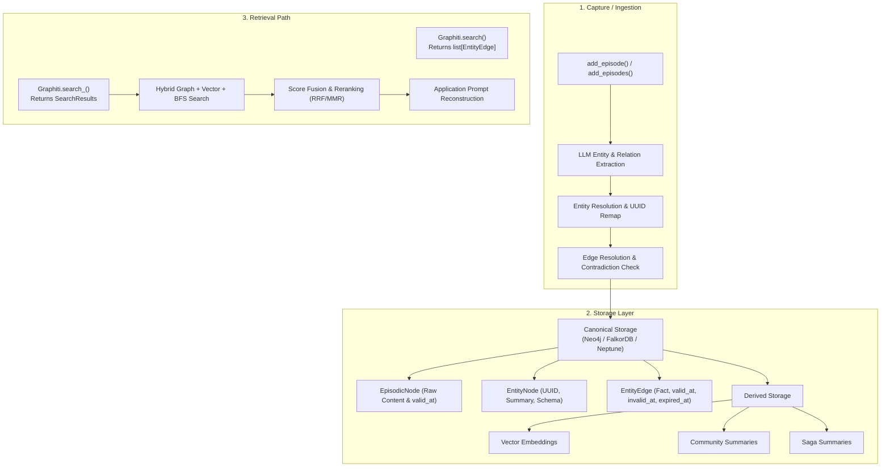

# Graphiti (`getzep/graphiti`)

## Problem

Agent memory systems that rely solely on flat key-value pairs, vector similarity searches, or unstructured message logs lose critical temporal context and historical state transitions over time. When a fact changes, simple overwrite strategies destroy historical truth, while append-only strategies create search-time contradictions.

Graphiti addresses this by building a bi-temporal knowledge graph (`valid_at`, `invalid_at`, `expired_at`). It extracts entities and relationships from episodes, resolves them against existing graph structures, and invalidates superseded facts without deleting historical evidence.

## Snapshot

- **Repository:** [`getzep/graphiti`](https://github.com/getzep/graphiti)
- **Snapshot Date:** 2026-07-24
- **GitHub Stars:** 29,154 stars (2,938 forks)
- **Pinned Commit:** [`3bb2d0bba56f8e22311574c045452c420a012f49`](https://github.com/getzep/graphiti/commit/3bb2d0bba56f8e22311574c045452c420a012f49) (authored 2026-07-23T23:03:23Z)
- **Declared Package Version:** `graphiti-core 0.29.2` (in `pyproject.toml`)
- **Latest Published Release:** `v0.29.2` (published 2026-06-08T14:25:35Z)
- **Release/Commit Gap:** The latest repository commit (2026-07-23) postdates the latest published release `v0.29.2` (2026-06-08) by six weeks.
- **Open Items:** GitHub repository `open_issues_count` is 434 (includes pull requests). The GitHub Issues Search API restricted to `is:issue is:open` returns 267 open issues.

## Architecture

### Capture and Ingestion

Graphiti ingests episode data via `Graphiti.add_episode()`, accepting raw episode text, source metadata, an event timestamp (`reference_time`), an optional `group_id`, schemas, and optional saga associations.

Ingestion proceeds through several steps:
1. **Context Window Retrieval:** Retrieves a bounded window of prior episodes.
2. **Extraction:** Uses LLMs to extract entities and entity edges (relationships).
3. **Entity Resolution:** Maps extracted entities against existing graph nodes and replaces temporary names with resolved entity UUIDs.
4. **Edge Resolution and Invalidation:** Detects edge contradictions against existing facts connecting the same endpoints.
5. **Persistence:** Hydrates entity attributes and writes nodes, edges, and episode pointers in bulk.

The documented operational requirement is serial, awaited ingestion per stream, though a bulk ingestion interface (`add_episodes()`) performs extraction and deduplication across multiple episodes in memory before graph persistence.

### Canonical and Derived Storage

Graphiti uses graph database abstractions via `GraphDriver` implementations (Neo4j by default, FalkorDB, AWS Neptune, and deprecated Kuzu):

- **Canonical Storage:**
  - `EpisodicNode`: Stores raw episode `content`, source description, and event reference timestamp (`valid_at`). Setting `store_raw_episode_content=False` purges raw episode text post-ingestion.
  - `EntityNode`: Represents deduplicated real-world concepts with `name`, `summary`, and typed attributes.
  - `EntityEdge` (`RELATES_TO`): Represents a specific temporal fact connecting two `EntityNode` UUIDs. Contains human-readable `fact`, supporting `episodes`, `valid_at` (when true), `invalid_at` (when invalidated), `expired_at` (system processing time), and `reference_time`.
  - `MENTIONS` and `SagaNode`: Map episodes to entity nodes and track wall-clock vs episode-valid watermarks.

- **Derived Storage:**
  - Entity embeddings, edge fact embeddings, and community summaries.
  - Derived elements can be recomputed only if source episodes and facts remain preserved in canonical storage.

### Update, Deletion, and Temporal Invalidation

When a new episode yields facts that contradict existing edges, Graphiti does not delete the old facts. In `resolve_edge_contradictions`:
- The existing edge's `invalid_at` timestamp is set to the new fact's `valid_at` event time.
- The existing edge's `expired_at` timestamp is set to current system time (`utc_now()`).
- New facts arriving already superseded are written with pre-set expiration.

Re-ingesting an episode UUID re-triggers graph resolution. Hard deletion is performed via `remove_episode()`, which purges the episode node and any entity nodes or edges exclusively attributable to that episode.

### Retrieval and Ranking

Graphiti provides two distinct search interfaces on the main `Graphiti` class:

1. **Basic Retrieval (`Graphiti.search`):** Standard edge-focused hybrid retrieval returning `list[EntityEdge]`.
2. **Advanced Structured Retrieval (`Graphiti.search_`):** Multi-scope search returning a `SearchResults` object containing distinct lists for `edges`, `nodes`, `episodes`, and `communities`, along with corresponding reranker score arrays (`edge_reranker_scores`, `node_reranker_scores`, `episode_reranker_scores`, `community_reranker_scores`).

Retrieval concurrently searches configured scopes using full-text, vector cosine similarity, and graph BFS traversals. Candidates are fused via Reciprocal Rank Fusion (RRF) or MMR reranking. `SearchFilters` allows callers to filter results by `valid_at` bounds and `reference_time` to prevent returning invalid or expired facts.

### Isolation, Tenancy, and Recovery

Logical multi-tenancy uses `group_id`. GraphDriver backends handle tenant isolation differently:
- **FalkorDB:** Groups map to physically separate databases/graphs, requiring driver cloning and routing per `group_id`.
- **Neo4j:** Groups filter by `group_id` node/edge properties.

Graphiti outputs structured retrieval records (`SearchResults` or `list[EntityEdge]`). It does not format final LLM prompts, enforce context limits, manage PII policies, or sanitize against prompt injection at the search boundary. Because multi-stage ingestion spans LLM API calls, embedding generations, and graph database writes without cross-system transactions, applications must manage retry idempotency and job-state tracking.

## Release History

The following chronological table records published GitHub Releases from `v0.1.0` through `v0.29.2`. (Tags without an official GitHub Release are labeled as tag-only).

| Published Date | Version / Tag | Type | Material Changes / Highlights | Release Link |
| :--- | :--- | :--- | :--- | :--- |
| 2024-08-27 | `v0.1.0` | Release | Initial public Graphiti release | [`v0.1.0`](https://github.com/getzep/graphiti/releases/tag/v0.1.0) |
| 2025-06-27 | `v0.14.0` | Release | Exclusion entity types, search filters, full-text fixes, UV migration | [`v0.14.0`](https://github.com/getzep/graphiti/releases/tag/v0.14.0) |
| 2025-07-07 | `v0.16.0` | Release | Bulk ingestion pipeline | [`v0.16.0`](https://github.com/getzep/graphiti/releases/tag/v0.16.0) |
| 2025-07-23 | `v0.18.0` | Release | Search-reranker scores returned, group-id filtering fixes | [`v0.18.0`](https://github.com/getzep/graphiti/releases/tag/v0.18.0) |
| 2025-09-03 | `v0.20.0` | Release | Parallel runtime option removed, efficiency rework | [`v0.20.0`](https://github.com/getzep/graphiti/releases/tag/v0.20.0) |
| 2025-10-06 | `v0.22.0` | Release | OpenTelemetry support, prompt/token optimization | [`v0.22.0`](https://github.com/getzep/graphiti/releases/tag/v0.22.0) |
| 2026-01-16 | `v0.26.0` | Release | Sagas support and custom extraction instructions | [`v0.26.0`](https://github.com/getzep/graphiti/releases/tag/v0.26.0) |
| 2026-02-17 | `v0.28.0` | Release | GraphDriver operations update | [`v0.28.0`](https://github.com/getzep/graphiti/releases/tag/v0.28.0) |
| 2026-04-27 | `v0.29.0` | Release | Combined node+edge extraction, batched extraction, saga API, Kuzu schema migration | [`v0.29.0`](https://github.com/getzep/graphiti/releases/tag/v0.29.0) |
| 2026-05-21 | `v0.29.1` | Release | Extraction quality guards, saga event-time watermark, FalkorDB Docker mount fix | [`v0.29.1`](https://github.com/getzep/graphiti/releases/tag/v0.29.1) |
| 2026-06-08 | `v0.29.2` | Release | Embedded FalkorDB support, FalkorDB fixes, Kuzu deprecated, MCP parity | [`v0.29.2`](https://github.com/getzep/graphiti/releases/tag/v0.29.2) |

*All material GitHub Releases published since 2026-03-24 are `v0.29.0`, `v0.29.1`, and `v0.29.2`.*

## Issue-Tab Findings

> **Note:** Open issue reports represent user claims and observations; they are not proven defects until confirmed by maintainers or linked code fixes.

### 1. Isolation, Tenancy, and Data Integrity

| Issue | Status | Opened / Updated | Description & Classification |
| :--- | :--- | :--- | :--- |
| [#1676](https://github.com/getzep/graphiti/issues/1676) | Open | 2026-07-23 / 2026-07-23 | Concurrent multi-group_id episode processing silently corrupts data across FalkorDB graphs (User report). |
| [#1659](https://github.com/getzep/graphiti/issues/1659) | Closed | 2026-07-17 / 2026-07-23 | `add_episode` re-binds driver but single-group_id search does not (Fixed by linked commit [`3bb2d0b`](https://github.com/getzep/graphiti/commit/3bb2d0bba56f8e22311574c045452c420a012f49)). |

### 2. Backend Portability, Deployment, and Persistence

| Issue | Status | Opened / Updated | Description & Classification |
| :--- | :--- | :--- | :--- |
| [#1674](https://github.com/getzep/graphiti/issues/1674) | Open | 2026-07-22 / 2026-07-23 | AWS Bedrock embeddings and reranking RFC (User feature request). |
| [#1522](https://github.com/getzep/graphiti/issues/1522) | Closed | 2026-05-31 / 2026-07-23 | FalkorDB Cloud auth drops URI username (User report; closed). |
| [#1623](https://github.com/getzep/graphiti/issues/1623) | Closed | 2026-07-01 / 2026-07-22 | Docker compose interpolates host `$PATH`, Windows startup crash (User report; closed). |
| [#1452](https://github.com/getzep/graphiti/issues/1452) | Closed | 2026-04-29 / 2026-05-14 | FalkorDB volume mounted at wrong data path (Fixed in release [`v0.29.1`](https://github.com/getzep/graphiti/releases/tag/v0.29.1)). |

### 3. Retrieval Relevance and Query Correctness

| Issue | Status | Opened / Updated | Description & Classification |
| :--- | :--- | :--- | :--- |
| [#1440](https://github.com/getzep/graphiti/issues/1440) | Closed | 2026-04-26 / 2026-07-23 | Malformed FalkorDB/RediSearch queries for backticks and stopword-only inputs (User report; closed). |
| [#1672](https://github.com/getzep/graphiti/issues/1672) | Open | 2026-07-20 / 2026-07-21 | `resolve_extracted_edge` range guard can leak duplicate edges (User report). |

### 4. Extraction Quality and API Ergonomics

| Issue | Status | Opened / Updated | Description & Classification |
| :--- | :--- | :--- | :--- |
| [#912](https://github.com/getzep/graphiti/issues/912) | Open | 2025-09-17 / 2026-05-22 | Pydantic `ExtractedEntities` validation failure using non-OpenAI / Ollama model (User report). |

*(Note: Pull Request [#1498](https://github.com/getzep/graphiti/pull/1498) added attribute hallucination guards and precision rules, confirming active maintainer work on extraction quality.)*

### 5. Performance, Cost, and Recovery Observability

| Issue | Status | Opened / Updated | Description & Classification |
| :--- | :--- | :--- | :--- |
| [#402](https://github.com/getzep/graphiti/issues/402) | Open | 2025-04-26 / 2026-04-30 | Label propagation lacks max iteration cap, causing CPU stalls (User report). |
| [#290](https://github.com/getzep/graphiti/issues/290) | Closed | 2025-03-13 / 2025-07-13 | Rate limits during ingestion leave partial graph state without clear recovery path (User report; closed). |

### 6. Data Governance

| Issue | Status | Opened / Updated | Description & Classification |
| :--- | :--- | :--- | :--- |
| [#1679](https://github.com/getzep/graphiti/issues/1679) | Open | 2026-07-24 / 2026-07-24 | Governance hooks needed for PII scanning, access control, and audit trails (User feature request). |

## What the Issues Reveal

1. **Backend Abstraction Leaks:** Abstracting multiple graph engines (Neo4j, FalkorDB, Kuzu) creates subtle discrepancies. Physical database isolation (FalkorDB) requires explicit per-request routing, whereas property-filtered isolation (Neo4j) risks state leakage under concurrency.
2. **Extraction Non-Determinism:** Provider variance across LLM backends (Ollama, OpenAI-compatible APIs) can break strict Pydantic extraction schemas, leading to ingestion failures.
3. **Lack of Ingestion Transactions:** Multi-stage graph extraction and writing lacks transactional rollback, leaving partial state when rate limits or API errors occur.
4. **Governance vs. Temporal Invalidation:** Soft-invalidating facts via temporal timestamps does not satisfy hard privacy or data access requirements (PII redaction or tenant-level ACLs).

## Relay Lessons

1. **Dual-Clock Temporal Tracking:** Separate event validity (`valid_at`/`invalid_at`) from system ingestion/processing time (`created_at`/`expired_at`).
2. **Decouple Raw Evidence from Derived Memory:** Maintain raw immutable episode logs independently from recomputable graph entity nodes, summaries, and embeddings.
3. **Probabilistic Extraction Resilience:** Treat LLM extraction as non-deterministic; store provenance references to source episode UUIDs and support re-extraction routines.
4. **Immutable Tenant Routing:** Enforce tenant identity strictly at the database driver boundary rather than relying on shared driver state.
5. **Explicit Retrieval Surface:** Distinguish standard edge/fact retrieval (`Graphiti.search`, returning `list[EntityEdge]`) from advanced multi-scope structured retrieval (`Graphiti.search_`, returning `SearchResults`), leaving prompt construction to application callers.
6. **Idempotent Ingestion Pipelines:** Make multi-step graph ingestion durable and idempotent to survive API rate limits or network failures.

## Sources

- **Repository Source & Pyproject:** [`pyproject.toml`](https://github.com/getzep/graphiti/blob/3bb2d0bba56f8e22311574c045452c420a012f49/pyproject.toml) declaring `graphiti-core 0.29.2`.
- **Ingestion Implementation:** [`graphiti_core/graphiti.py`](https://github.com/getzep/graphiti/blob/3bb2d0bba56f8e22311574c045452c420a012f49/graphiti_core/graphiti.py) (`add_episode`, `search_`, `remove_episode`).
- **Data Models:** [`graphiti_core/nodes.py`](https://github.com/getzep/graphiti/blob/3bb2d0bba56f8e22311574c045452c420a012f49/graphiti_core/nodes.py) (`EpisodicNode`, `SagaNode`) and [`graphiti_core/edges.py`](https://github.com/getzep/graphiti/blob/3bb2d0bba56f8e22311574c045452c420a012f49/graphiti_core/edges.py) (`EntityEdge`).
- **Contradiction Maintenance:** [`graphiti_core/utils/maintenance/edge_operations.py`](https://github.com/getzep/graphiti/blob/3bb2d0bba56f8e22311574c045452c420a012f49/graphiti_core/utils/maintenance/edge_operations.py) (`resolve_edge_contradictions`).
- **Search Implementation:** [`graphiti_core/search/search.py`](https://github.com/getzep/graphiti/blob/3bb2d0bba56f8e22311574c045452c420a012f49/graphiti_core/search/search.py) (`search_`, `SearchResults`).
- **GitHub APIs:** GitHub Releases API and GitHub Issues Search API for `getzep/graphiti` accessed 2026-07-24.
