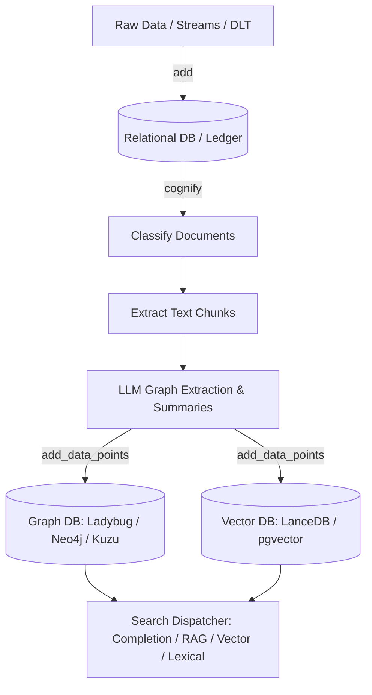

# Cognee Architecture and Issue Analysis

## Problem

Cognee is a persistent memory and context management framework for AI applications and agents. Rather than treating memory as an ephemeral chat history buffer or a simple vector store index, Cognee organizes unstructured information into a structured, queryable graph and vector knowledge base. However, running a multi-store pipeline (spanning relational, graph, vector, and cache layers) introduces complex challenges in data persistence, multi-stage ingestion, retriever isolation, deletion atomicity, and schema migrations.

## Snapshot

* **Repository:** [`topoteretes/cognee`](https://github.com/topoteretes/cognee)
* **Stars / Date:** 29,260 stars, 2,785 forks, 609 open items (including PRs; 222 open issues) on 2026-07-24
* **Pinned commit:** `90b4acaac937dc1c0aeffaead8b707c896ebf3db` (2026-07-21)
* **Declared source package version at the pinned commit:** `1.4.0`. **Latest published GitHub Release:** prerelease [`v1.4.0.dev1`](https://github.com/topoteretes/cognee/releases/tag/v1.4.0.dev1) (2026-07-22).

## Architecture

### Capture

Ingestion in Cognee is split into a deliberate two-stage workflow: raw data registration via `add()` followed by graph/vector derivation via `cognify()`.

* `add()` accepts text strings, file paths, streams, `DataItem` objects, and DLT sources. It stores raw data into the relational database and dataset ledger. For foreground execution, orphan cleanup is executed after pipeline commitment to avoid mid-ingest data loss; for background tasks, caller streams are materialized up front before enqueueing.
* `cognify()` processes previously added datasets through a task pipeline. The default task sequence includes document classification, semantic chunking, LLM-based entity/relationship graph extraction, chunk summarization, and saving node/edge/embedding points into target databases.

### Canonical and Derived Storage

Cognee uses a hybrid, multi-store architecture rather than a single database transaction.

* **Canonical/Ledger Layer:** Relational storage (PostgreSQL/SQLite via SQLAlchemy/Alembic) manages users, datasets, file items, pipelines, and execution metadata.
* **Derived Index Layer:** Graph storage (defaulting to Ladybug, with optional Neo4j, Kuzu, or Neptune) holds extracted entities, triplet relations, and ontology properties. Vector storage (defaulting to LanceDB, with optional pgvector or Turso) holds chunk embeddings and graph node embeddings.

### Update and Delete

* **Incremental Processing:** `add()` and `cognify()` support `incremental_loading=True` to process only fresh or modified items.
* **Deletion Lifecycle:** Deletion is performed via `cognee.datasets.delete_data()` (or `delete_all()`), replacing the deprecated top-level `delete()` interface. Deletion authorizes the action against dataset user permissions, removes graph nodes/edges associated with data provenance, cleans up relational records, and removes empty datasets if configured.
* **Transaction Limits:** Operations across graph, vector, relational, and session caches are not globally atomic. Deletion errors or residual session caches can leave unpurged context across derived stores.

### Retrieval and Prompt Reconstruction

* **Search Entry Point:** `cognee.search()` resolves authorized datasets for the calling user and delegates to a retriever dispatcher with configurable parameters (`top_k`, wide search, triplet distance penalties, neighborhood expansion, and system prompts).
* **Retrieval Modes:** Supports GRAPH_COMPLETION (LLM completion using graph context), RAG_COMPLETION, CHUNKS (vector search over text chunks), SUMMARIES, CODE, CYPHER, BM25 (lexical exact match), and automatic agentic routing.
* **Prompt Reconstruction:** Reconstruction varies by mode. Completion modes combine selected graph subgraphs or chunk context with system prompts to formulate LLM inputs, whereas raw chunk retrieval returns sorted passage lists.

### Isolation and Recovery

* **Tenant Isolation:** Dataset operations apply permission checks (`read`, `write`, `delete`) and scope queries using tenant database contexts (`dataset_id` / `user_id`).
* **Startup & Recovery:** Startup routines (`cognee.api.client`) execute database migrations automatically and run `recover_stale_cognify_runs_on_startup()`. (Note: source code shows invocation of `recover_stale_cognify_runs_on_startup()`, but not that every crashed job is resumed.)
* **Store Recovery:** Engine adapters include self-healing paths, such as removing corrupted Ladybug WAL logs (discarding uncommitted transactions from crashed sessions) or rebuilding LanceDB tables when Pydantic schemas drift. Kuzu migrations require manual database backups for downgrades.

## Release History

The first verifiable public GitHub release is tag `0.0.1` published on October 8, 2023. Current `v1.3` and `v1.4` GitHub release descriptions contain autogenerated draft placeholder text, so specific architectural claims are verified directly against source code rather than release body text.

| Date | Tag / Release | Notes |
| :--- | :--- | :--- |
| 2023-10-08 | [`0.0.1`](https://github.com/topoteretes/cognee/releases/tag/0.0.1) | First verifiable public GitHub release |
| 2026-03-30 | [`v0.5.6`](https://github.com/topoteretes/cognee/releases/tag/v0.5.6) | Minor release |
| 2026-04-03 | [`v0.5.7`](https://github.com/topoteretes/cognee/releases/tag/v0.5.7) | Minor release |
| 2026-04-07 | [`v0.5.8`](https://github.com/topoteretes/cognee/releases/tag/v0.5.8) | Minor release |
| 2026-04-08 | [`v0.5.8rc1`](https://github.com/topoteretes/cognee/releases/tag/v0.5.8rc1) | Release candidate |
| 2026-04-09 | [`v0.5.4.dev3`](https://github.com/topoteretes/cognee/releases/tag/v0.5.4.dev3) | GitHub Release (dev-named build; not marked prerelease by GitHub) |
| 2026-04-09 | [`v0.5.7.dev0`](https://github.com/topoteretes/cognee/releases/tag/v0.5.7.dev0) | Prerelease |
| 2026-04-10 | [`v0.5.5.dev1`](https://github.com/topoteretes/cognee/releases/tag/v0.5.5.dev1) | GitHub Release (dev-named build; not marked prerelease by GitHub) |
| 2026-04-11 | [`v1.0.0.dev0`](https://github.com/topoteretes/cognee/releases/tag/v1.0.0.dev0) | Prerelease |
| 2026-04-11 | [`v1.0.0`](https://github.com/topoteretes/cognee/releases/tag/v1.0.0) | Major release milestone |
| 2026-04-14 | [`v1.0.1.dev0`](https://github.com/topoteretes/cognee/releases/tag/v1.0.1.dev0) | Prerelease |
| 2026-04-15 | [`v1.0.1.dev1`](https://github.com/topoteretes/cognee/releases/tag/v1.0.1.dev1) | GitHub Release (dev-named build; not marked prerelease by GitHub) |
| 2026-04-16 | [`v1.0.1.dev2`](https://github.com/topoteretes/cognee/releases/tag/v1.0.1.dev2) | Prerelease |
| 2026-04-16 | [`v1.0.1.dev3`](https://github.com/topoteretes/cognee/releases/tag/v1.0.1.dev3) | Prerelease |
| 2026-04-18 | [`v1.0.1`](https://github.com/topoteretes/cognee/releases/tag/v1.0.1) | Patch release |
| 2026-04-21 | [`v1.0.1.dev4`](https://github.com/topoteretes/cognee/releases/tag/v1.0.1.dev4) | Prerelease |
| 2026-04-22 | [`v1.0.2`](https://github.com/topoteretes/cognee/releases/tag/v1.0.2) | Patch release |
| 2026-04-24 | [`v1.0.3`](https://github.com/topoteretes/cognee/releases/tag/v1.0.3) | Patch release |
| 2026-04-25 | [`v1.0.4.dev0`](https://github.com/topoteretes/cognee/releases/tag/v1.0.4.dev0) | GitHub Release (dev-named build; not marked prerelease by GitHub) |
| 2026-05-03 | [`v1.0.4`](https://github.com/topoteretes/cognee/releases/tag/v1.0.4) | Patch release |
| 2026-05-03 | [`v1.0.5`](https://github.com/topoteretes/cognee/releases/tag/v1.0.5) | Patch release |
| 2026-05-05 | [`v1.0.6`](https://github.com/topoteretes/cognee/releases/tag/v1.0.6) | Patch release |
| 2026-05-05 | [`v1.0.7`](https://github.com/topoteretes/cognee/releases/tag/v1.0.7) | Patch release |
| 2026-05-06 | [`v1.0.8`](https://github.com/topoteretes/cognee/releases/tag/v1.0.8) | Patch release |
| 2026-05-08 | [`v1.0.9`](https://github.com/topoteretes/cognee/releases/tag/v1.0.9) | Patch release |
| 2026-05-12 | [`v1.1.0.dev0`](https://github.com/topoteretes/cognee/releases/tag/v1.1.0.dev0) | GitHub Release (dev-named build; not marked prerelease by GitHub) |
| 2026-05-13 | [`v1.1.0.dev1`](https://github.com/topoteretes/cognee/releases/tag/v1.1.0.dev1) | GitHub Release (dev-named build; not marked prerelease by GitHub) |
| 2026-05-16 | [`v1.1.0`](https://github.com/topoteretes/cognee/releases/tag/v1.1.0) | Feature release |
| 2026-05-22 | [`v1.1.1.dev0`](https://github.com/topoteretes/cognee/releases/tag/v1.1.1.dev0) | GitHub Release (dev-named build; not marked prerelease by GitHub) |
| 2026-05-29 | [`v1.1.1`](https://github.com/topoteretes/cognee/releases/tag/v1.1.1) | Patch release |
| 2026-05-30 | [`v1.1.2`](https://github.com/topoteretes/cognee/releases/tag/v1.1.2) | Patch release |
| 2026-06-17 | [`v1.2.0.dev0`](https://github.com/topoteretes/cognee/releases/tag/v1.2.0.dev0) | GitHub Release (dev-named build; not marked prerelease by GitHub) |
| 2026-06-18 | [`v1.1.3`](https://github.com/topoteretes/cognee/releases/tag/v1.1.3) | Patch release |
| 2026-06-19 | [`v1.2.0.dev1`](https://github.com/topoteretes/cognee/releases/tag/v1.2.0.dev1) | Prerelease |
| 2026-06-21 | [`v1.2.0`](https://github.com/topoteretes/cognee/releases/tag/v1.2.0) | Feature release |
| 2026-06-21 | [`v1.2.1`](https://github.com/topoteretes/cognee/releases/tag/v1.2.1) | Patch release |
| 2026-06-25 | [`v1.2.2.dev0`](https://github.com/topoteretes/cognee/releases/tag/v1.2.2.dev0) | GitHub Release (dev-named build; not marked prerelease by GitHub) |
| 2026-06-26 | [`v1.2.2`](https://github.com/topoteretes/cognee/releases/tag/v1.2.2) | Patch release |
| 2026-07-06 | [`v1.2.2.dev1`](https://github.com/topoteretes/cognee/releases/tag/v1.2.2.dev1) | GitHub Release (dev-named build; not marked prerelease by GitHub) |
| 2026-07-07 | [`v1.2.2.dev2`](https://github.com/topoteretes/cognee/releases/tag/v1.2.2.dev2) | GitHub Release (dev-named build; not marked prerelease by GitHub) |
| 2026-07-07 | [`v1.2.2.dev3`](https://github.com/topoteretes/cognee/releases/tag/v1.2.2.dev3) | GitHub Release (dev-named build; not marked prerelease by GitHub) |
| 2026-07-07 | [`v1.2.2.dev4`](https://github.com/topoteretes/cognee/releases/tag/v1.2.2.dev4) | GitHub Release (dev-named build; not marked prerelease by GitHub) |
| 2026-07-12 | [`v1.3.0`](https://github.com/topoteretes/cognee/releases/tag/v1.3.0) | GitHub Release; placeholder body does not establish a specific milestone. |
| 2026-07-17 | [`v1.4.0`](https://github.com/topoteretes/cognee/releases/tag/v1.4.0) | GitHub Release; placeholder body does not establish a specific milestone. |
| 2026-07-20 | [`v1.4.0.dev0`](https://github.com/topoteretes/cognee/releases/tag/v1.4.0.dev0) | GitHub Release (dev-named build; not marked prerelease by GitHub) |
| 2026-07-22 | [`v1.4.0.dev1`](https://github.com/topoteretes/cognee/releases/tag/v1.4.0.dev1) | Prerelease |

## Issue-Tab Findings

Public issue reports represent unverified user claims until confirmed by maintainers or code changes.

### Extraction Quality & API/Model Compatibility

The issue records below report extraction failures or propose compatibility improvements; the behaviors remain unverified unless otherwise classified.

| Issue | Status | Opened / Updated | Classification |
| :--- | :--- | :--- | :--- |
| [#4204 Ontology extraction fails on `gpt-4o-mini` strict JSON schema](https://github.com/topoteretes/cognee/issues/4204) | Open | 2026-07-23 / 2026-07-23 | User report |
| [#3154 BeautifulSoup overlapping extraction rules duplicate content](https://github.com/topoteretes/cognee/issues/3154) | Open | 2026-06-20 / 2026-07-22 | User report |
| [#3870 Robust ingest for fixed-capacity local LLMs](https://github.com/topoteretes/cognee/issues/3870) | Open | 2026-07-04 / 2026-07-21 | Proposal |

### Retrieval Relevance & Correctness

The records below report possible cross-dataset leakage and request cognify-lag visibility; neither is independently confirmed here.

| Issue | Status | Opened / Updated | Classification |
| :--- | :--- | :--- | :--- |
| [#4079 Node-set scoped hybrid search leaks other node sets](https://github.com/topoteretes/cognee/issues/4079) | Open | 2026-07-15 / 2026-07-15 | User report |
| [#3553 Surface cognify lag instead of silent empty recall](https://github.com/topoteretes/cognee/issues/3553) | Open | 2026-06-27 / 2026-07-16 | Proposal |
| [#3420 Hybrid retrieval normalization/sorting missing](https://github.com/topoteretes/cognee/issues/3420) | Closed | 2026-06-24 / 2026-07-10 | Triage closed |

### Data Integrity & Lifecycle

The records below report stale-context or ID-collision symptoms; issue state alone does not establish a cross-store defect.

| Issue | Status | Opened / Updated | Classification |
| :--- | :--- | :--- | :--- |
| [#4030 Stale session context asserts hard-deleted data](https://github.com/topoteretes/cognee/issues/4030) | Open | 2026-07-11 / 2026-07-17 | User report |
| [#4029 Byte-identical batch adds hit a unique-ID race](https://github.com/topoteretes/cognee/issues/4029) | Closed | 2026-07-11 / 2026-07-13 | Triage closed |
| [#3876 Successful add/cognify not reliably searchable under concurrent datasets](https://github.com/topoteretes/cognee/issues/3876) | Closed | 2026-07-04 / 2026-07-09 | Triage closed |

### Reader Access & Storage-Isolation Requests

The records below report a raw-file-reader problem or request schema-per-dataset isolation; they do not establish an isolation defect.

| Issue | Status | Opened / Updated | Classification |
| :--- | :--- | :--- | :--- |
| [#4162 Readers cannot open raw data files](https://github.com/topoteretes/cognee/issues/4162) | Open | 2026-07-20 / 2026-07-22 | User report |
| [#3794 Schema-per-dataset pgvector isolation](https://github.com/topoteretes/cognee/issues/3794) | Open | 2026-07-02 / 2026-07-20 | Feature request |

### Backend Portability & Schema

The records below report backend-schema mismatches across optional store drivers; they do not establish a general adapter failure.

| Issue | Status | Opened / Updated | Classification |
| :--- | :--- | :--- | :--- |
| [#4187 Neo4j ID/property mismatch and dropped edge properties](https://github.com/topoteretes/cognee/issues/4187) | Open | 2026-07-22 / 2026-07-22 | User report |
| [#4123 Cypher/NL search imports Postgres adapter without its extra](https://github.com/topoteretes/cognee/issues/4123) | Open | 2026-07-19 / 2026-07-19 | User report |
| [#3585 Ladybug neighborhood assertion](https://github.com/topoteretes/cognee/issues/3585) | Closed | 2026-06-27 / 2026-07-23 | Triage closed |

### Performance, Cost & Operations

The records below report operational scale concerns or propose cost controls; the alleged behaviors remain unverified unless otherwise classified.

| Issue | Status | Opened / Updated | Classification |
| :--- | :--- | :--- | :--- |
| [#4197 Cancelled requests leak Postgres sessions](https://github.com/topoteretes/cognee/issues/4197) | Open | 2026-07-23 / 2026-07-23 | User report |
| [#3626 DLT ingestion scalability](https://github.com/topoteretes/cognee/issues/3626) | Open | 2026-06-28 / 2026-07-09 | Proposal |
| [#3516 Reduce cognify LLM calls](https://github.com/topoteretes/cognee/issues/3516) | Open | 2026-06-26 / 2026-07-13 | Proposal |

### Observability & Documentation

The records below propose or request diagnostics and documentation improvements; they do not establish missing observability in every deployment.

| Issue | Status | Opened / Updated | Classification |
| :--- | :--- | :--- | :--- |
| [#3681 Plugin doctor/status](https://github.com/topoteretes/cognee/issues/3681) | Open | 2026-06-29 / 2026-07-13 | Proposal |
| [#4180 Azure OpenAI + pgvector quickstart](https://github.com/topoteretes/cognee/issues/4180) | Open | 2026-07-22 / 2026-07-22 | Documentation request |

## What the Issues Reveal

1. **Freshness and deletion visibility:** Separating `add()` from `cognify()` creates a freshness/visibility requirement. #3553 proposes surfacing cognify lag rather than proving that every search immediately after `add()` returns empty recall. Multi-store deletion similarly creates a stale-state risk; #4030 is a user report, not proof of universal residual data.
2. **Pluggable adapter variance:** The records report driver-specific schema mismatches, optional dependency errors, and retrieval-boundary concerns across graph and vector engines.
3. **LLM cost and pipeline budgeting:** The records and proposals identify potential LLM-cost and scale pressure during cognify; they support budgeting and observability, not a claim that every deployment is overloaded.

## Relay Lessons

1. **Separate Ingestion Ledger from Derived Indexes:** Maintain an explicit canonical record of raw memory items before deriving vector or graph structures.
2. **Cross-Store Deletion Contracts:** Guarantee atomic or verifiable multi-store deletion so purged context does not linger in graph nodes, vector segments, or session caches.
3. **Pipeline Processing Observability:** Provide clear status indicators and watermarks so callers know when background memory extraction is complete and queryable.
4. **Scope-Enforced Retrieval:** Enforce tenant and permission filters directly at the query level across all vector, graph, and keyword retrievers.
5. **Adapter Isolation:** Test pluggable backend adapters thoroughly against real engines to prevent driver-specific schema drift and leakages.

## Sources

* **Source Code Repository:** [`topoteretes/cognee`](https://github.com/topoteretes/cognee) at commit [`90b4acaac937dc1c0aeffaead8b707c896ebf3db`](https://github.com/topoteretes/cognee/commit/90b4acaac937dc1c0aeffaead8b707c896ebf3db) (2026-07-21).
* **Ingestion and Derivation Pipelines:** [`cognee/api/v1/add/add.py`](https://github.com/topoteretes/cognee/blob/90b4acaac937dc1c0aeffaead8b707c896ebf3db/cognee/api/v1/add/add.py), [`cognee/api/v1/cognify/cognify.py`](https://github.com/topoteretes/cognee/blob/90b4acaac937dc1c0aeffaead8b707c896ebf3db/cognee/api/v1/cognify/cognify.py).
* **Dataset Lifecycle and Authorized Search:** [`cognee/api/v1/datasets/datasets.py`](https://github.com/topoteretes/cognee/blob/90b4acaac937dc1c0aeffaead8b707c896ebf3db/cognee/api/v1/datasets/datasets.py), [`cognee/api/v1/search/search.py`](https://github.com/topoteretes/cognee/blob/90b4acaac937dc1c0aeffaead8b707c896ebf3db/cognee/api/v1/search/search.py).
* **Database Migrations and Recovery:** [`cognee/api/client.py`](https://github.com/topoteretes/cognee/blob/90b4acaac937dc1c0aeffaead8b707c896ebf3db/cognee/api/client.py), [`cognee/infrastructure/databases/graph/ladybug/adapter.py`](https://github.com/topoteretes/cognee/blob/90b4acaac937dc1c0aeffaead8b707c896ebf3db/cognee/infrastructure/databases/graph/ladybug/adapter.py).
* **GitHub Metadata & API Snapshots:** GitHub REST API queries for repository statistics, release history, and issue tracking fetched on 2026-07-24.
