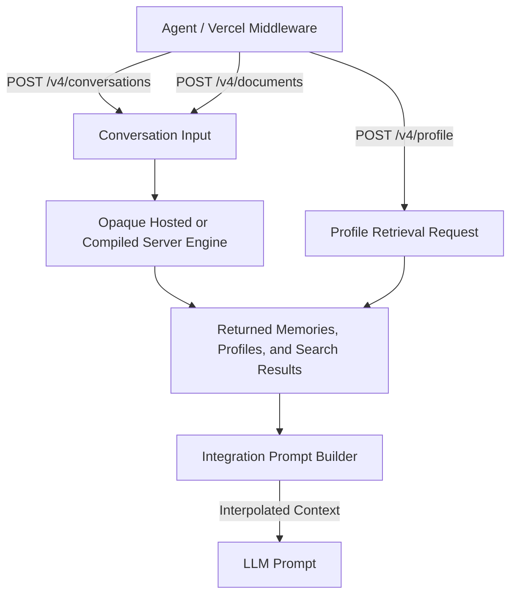

# Supermemory

Supermemory provides an API-first memory and context engine that extracts facts from conversations, documents, and web content to maintain structured static and dynamic profiles alongside hybrid search capabilities.

## Problem

Agent applications requiring long-term user context often struggle to bridge unstructured conversation logs with structured, reusable profile data. Supermemory solves this by automatically processing incoming conversations and documents, extracting facts, resolving temporal contradictions, and serving structured profile blocks (`static` and `dynamic`) and vector-search memories over a single API.

## Snapshot

- **Repository:** [`supermemoryai/supermemory`](https://github.com/supermemoryai/supermemory)
- **Stars / Date:** 28,589 stars | 2026-07-24 snapshot (2,485 forks; 35 open issues from issue-only search, with PRs excluded; repository aggregate was 91 including PRs).
- **Pinned Commit:** [`e6857620124a51f346e3b5fe838d9a4a04444380`](https://github.com/supermemoryai/supermemory/commit/e6857620124a51f346e3b5fe838d9a4a04444380) (main branch; 2026-07-24 15:51:19Z).
- **Latest Release:** `server-v0.0.7-rc.2` (2026-07-22) | npm package `supermemory@4.24.2` (2026-07-20).
- **Note on repository scope:** The public repository contains the web application, SDKs, middleware, UI, and integration packages. The underlying server engine implementation is distributed as a compiled binary; internal storage schemas and graph/vector engine code are proprietary or binary-embedded rather than open-source code in the primary repository.

## Architecture

### Capture

Ingestion occurs through SDK methods (`client.add()`), direct API calls (`/v3/documents`, `/v4/conversations`), file uploads, and hosted connectors (Google Drive, Gmail, Notion, OneDrive, GitHub, webhooks). The Vercel AI SDK integration serializes conversation history—optionally including tool calls and tool results—and asynchronously posts it to `/v4/conversations` following model execution.

### Observable public contract and opaque storage

The observable public contract keeps document/conversation input objects distinct from returned memories, profiles, and search results. The hosted/server canonical schema and graph/vector index implementation are not public in this checkout. Self-hosting documentation only establishes an embedded graph engine, local storage under `./.supermemory`, and configurable embeddings (default `Xenova/bge-base-en-v1.5`, 768 dimensions).

### Update and delete

Official documentation says the opaque engine resolves contradictions and expires irrelevant facts, and public SDKs expose document/memory mutation operations. Transactional delete atomicity is not publicly source-verifiable because the implementation is compiled/proprietary.

### Retrieval

Context reconstruction uses the `POST /v4/profile` endpoint, which returns structured profile payloads containing:
- `profile.static`: Permanent user facts (e.g., identity, preferences).
- `profile.dynamic`: Evolving user state (e.g., current active goals, recent context).
- `searchResults`: Relevant memories retrieved via hybrid search (combining keyword and vector relevance).

Retrieval can run in three modes: `profile` (returns only static/dynamic profile blocks), `query` (returns vector search results for the user query), or `full` (combines static/dynamic profiles and query search results). The integration layer deduplicates returned items, converts profiles to structured Markdown headers (`## Static Profile`, `## Dynamic Profile`), and interpolates the text into configured prompt templates.

### Isolation and recovery

Integrations pass caller-supplied `containerTag` values as logical namespaces and distinguish personal/project/agent patterns. This does not prove service-side authorization isolation; the integrating service must bind tags to authenticated identity.
- **Recovery:** Local self-hosted deployments store state and vector indexes on disk in `./.supermemory`. Server binary initialization automatically handles key creation and embedding plan registration.

## Release history

| Date | Release / Tag | Description / Notes | Evidence |
| :--- | :--- | :--- | :--- |
| 2025-04-12 | `supermemory@0.0.0` | First public npm package release | [npm Release](https://www.npmjs.com/package/supermemory/v/0.0.0) |
| 2025-05-11 | `supermemory@3.0.0-alpha.0` | Initial 3.0 alpha package releases | npm Release |
| 2025-09-21 | `supermemory@3.1.0` | Stable 3.x client package milestone | npm Release |
| 2025-12-20 | `supermemory@4.0.0` | Major 4.0 client package line release | npm Release |
| 2026-04-03 | `supermemory@4.21.0` | Feature update for JS/TS client integration | npm Release |
| 2026-05-31 | `server-v0.0.1-rc.2` | First verifiable GitHub server prerelease | [GitHub Release](https://github.com/supermemoryai/supermemory/releases/tag/server-v0.0.1-rc.2) |
| 2026-06-04 | `server-v0.0.1-rc.8` | Server stabilization prerelease | [GitHub Release](https://github.com/supermemoryai/supermemory/releases/tag/server-v0.0.1-rc.8) |
| 2026-06-10 | `server-v0.0.1`, `server-v0.0.2` | First stable self-hosted server releases | [GitHub Release](https://github.com/supermemoryai/supermemory/releases/tag/server-v0.0.2) |
| 2026-06-13 | `server-v0.0.3` | Patch release for server binary | [GitHub Release](https://github.com/supermemoryai/supermemory/releases/tag/server-v0.0.3) |
| 2026-07-10 | `server-v0.0.4` | Expanded memory extraction, time-aware search, and profile buckets | [GitHub Release](https://github.com/supermemoryai/supermemory/releases/tag/server-v0.0.4) |
| 2026-07-10 | `server-v0.0.5` | Pluggable local/remote embeddings and embedding plan persistence | [GitHub Release](https://github.com/supermemoryai/supermemory/releases/tag/server-v0.0.5) |
| 2026-07-19 | `server-v0.0.6` | Support added for self-hosted Windows binaries | [GitHub Release](https://github.com/supermemoryai/supermemory/releases/tag/server-v0.0.6) |
| 2026-07-20 | `supermemory@4.24.2` | Current published npm client package | npm Release |
| 2026-07-22 | `server-v0.0.7-rc.2` | Offloaded step data for >128KiB inputs and hardened shutdown lifecycle | [GitHub Release](https://github.com/supermemoryai/supermemory/releases/tag/server-v0.0.7-rc.2) |

## Issue-tab findings

The repository issue tracker reflects challenges around database migrations across server releases, binary queue behavior for large documents, embedding model changes, and client SDK context isolation. Open issue reports represent user claims and are not proven defects.

### Migration, schema, and local server persistence

| Issue | Status | Dates | Description & Classification |
| :--- | :--- | :--- | :--- |
| [#1325](https://github.com/supermemoryai/supermemory/issues/1325) | Open | Opened 2026-07-21 Updated 2026-07-21 | Migration failure on `server-v0.0.6` reporting schema collision (`observatory already exists`). *User report* |
| [#1293](https://github.com/supermemoryai/supermemory/issues/1293) | Open | Opened 2026-07-14 Updated 2026-07-18 | Upgrade from `v0.0.5` skipped profile-buckets migration, preventing context grouping. *User report* |
| [#1103](https://github.com/supermemoryai/supermemory/issues/1103) | Closed | Opened 2026-06-12 Updated 2026-06-13 | Server upgrade resulted in zero vector search matches. *Maintainer-closed* |
| [#1317](https://github.com/supermemoryai/supermemory/issues/1317) | Open | Opened 2026-07-20 Updated 2026-07-22 | Failure to unlock local disk storage after server reboot. *User report* |

### Ingestion queue, data integrity, and document limits

| Issue | Status | Dates | Description & Classification |
| :--- | :--- | :--- | :--- |
| [#1203](https://github.com/supermemoryai/supermemory/issues/1203) | Closed | Opened 2026-07-05 Updated 2026-07-17 | Ingesting documents >128KiB permanently wedged the queue and prevented document deletion. *Fixed by release-linked code:* Fixed in `server-v0.0.7-rc.2` by offloading step data past Rivet's KV limit. |
| [#1324](https://github.com/supermemoryai/supermemory/issues/1324) | Open | Opened 2026-07-21 Updated 2026-07-21 | Linux self-hosted binary missing embedded Rivet WASM module, stalling ingestion jobs. *User report* |
| [#1302](https://github.com/supermemoryai/supermemory/issues/1302) | Closed | Opened 2026-07-17 Updated 2026-07-21 | Re-ingesting failed documents without modification could not trigger re-extraction. *Maintainer-closed* |

### Embedding model portability and retrieval accuracy

| Issue | Status | Dates | Description & Classification |
| :--- | :--- | :--- | :--- |
| [#1104](https://github.com/supermemoryai/supermemory/issues/1104) | Open | Opened 2026-06-12 Updated 2026-07-17 | Default English embedding model (`bge-base-en-v1.5`) degraded recall for non-English content. *Maintainer-assigned user report* |
| [#1336](https://github.com/supermemoryai/supermemory/issues/1336) | Open | Opened 2026-07-22 Updated 2026-07-22 | Custom embedding environment variables ignored by local server instance. *User report* |
| [#1320](https://github.com/supermemoryai/supermemory/issues/1320) | Open | Opened 2026-07-21 Updated 2026-07-21 | Concurrent local embedding execution caused segmentation faults in binary. *User report* |

### Multi-tenancy, middleware, and SDK ergonomics

| Issue | Status | Dates | Description & Classification |
| :--- | :--- | :--- | :--- |
| [#1206](https://github.com/supermemoryai/supermemory/issues/1206) | Closed | Opened 2026-07-06 Updated 2026-07-11 | Vercel middleware dropped tool-call and tool-result messages during memory extraction. *Maintainer-confirmed fixed:* Fixed by project member; tool call/result inclusion is now configurable. |
| [#1246](https://github.com/supermemoryai/supermemory/issues/1246) | Closed | Opened 2026-07-12 Updated 2026-07-21 | MCP list/graph endpoints returned records across all projects while search remained container-scoped. *Maintainer-closed* |
| [#1241](https://github.com/supermemoryai/supermemory/issues/1241) | Closed | Opened 2026-07-12 Updated 2026-07-18 | Documentation stated `addMemory` defaulted to `never`, whereas client code defaulted to `always`. *Fixed by source:* Source updated to explicitly state `addMemory = "always"`. |

## What the issues reveal

1. **Migration safety and embedding versioning:** Introducing persisted embedding plans (`server-v0.0.5`) prevents vector dimension mismatch, but server upgrades require strict preflight validation to prevent database schema collisions or missing profile migrations.
2. **Ingestion boundary enforcement:** Large inputs or unhandled binary worker steps can stall local processing queues. Ingestion systems require explicit payload size checks and step data offloading.
3. **Decoupled multi-tenancy enforcement:** Relying on client-provided tags (`containerTag`) requires consistent scope enforcement across all API endpoints (search, profile, list, and graph visualization) to avoid cross-tenant leaks.
4. **Asynchronous memory capture feedback:** Silently swallowing errors during background conversation saving hides extraction failures from agent callers.

## Relay lessons

1. **Separate raw records from derived projections:** Maintain raw conversation logs independently from extracted facts and vector embeddings to allow safe re-extraction and schema migrations.
2. **Strict tenant scoping:** Enforce tenant/container boundaries at the database storage layer rather than relying on optional request-level parameters.
3. **Explicit embedding plan registry:** Tag vector stores with their generating model name and dimensions; fail fast on model mismatches rather than polluting vector indexes with incompatible embeddings.
4. **Expose ingestion status:** Provide explicit job status endpoints (`queued`, `processing`, `failed`, `completed`) instead of silent fire-and-forget memory persistence.

## Sources

- **Supermemory Primary Repository:** [`supermemoryai/supermemory`](https://github.com/supermemoryai/supermemory)
- **GitHub Commit:** [`e6857620124a51f346e3b5fe838d9a4a04444380`](https://github.com/supermemoryai/supermemory/commit/e6857620124a51f346e3b5fe838d9a4a04444380) (main; 2026-07-24 15:51:19Z)
- **npm Registry:** [`supermemory`](https://www.npmjs.com/package/supermemory)
- **Official Documentation:** [Supermemory Overview](https://supermemory.ai/docs/self-hosting/overview)
- **Vercel AI SDK Integration:** [`packages/tools/src/vercel/middleware.ts`](https://github.com/supermemoryai/supermemory/blob/e6857620124a51f346e3b5fe838d9a4a04444380/packages/tools/src/vercel/middleware.ts)
- **Prompt Builder:** [`packages/tools/src/shared/prompt-builder.ts`](https://github.com/supermemoryai/supermemory/blob/e6857620124a51f346e3b5fe838d9a4a04444380/packages/tools/src/shared/prompt-builder.ts)
- **Memory Client:** [`packages/tools/src/shared/memory-client.ts`](https://github.com/supermemoryai/supermemory/blob/e6857620124a51f346e3b5fe838d9a4a04444380/packages/tools/src/shared/memory-client.ts)
