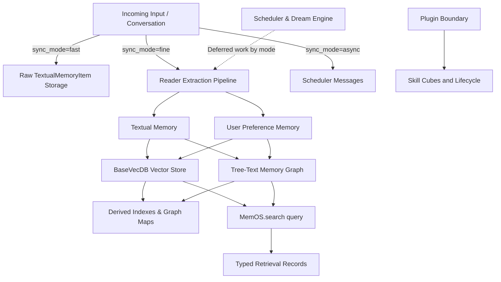

# MemOS active agent-memory research note

## Problem

Agents operating over extended sessions struggle to manage multi-tiered memory types (textual facts, user preferences, activation patterns, parametric knowledge, and execution skills) without encountering storage bloat, stale memory, or high token overhead during context reconstruction.

MemOS addresses this by structuring agent memory as an operating system layer (`MemOS_core`). `MemoryOS.add()` supports fast/raw capture, fine reader-based extraction, and async scheduled work; textual and preference processing may run in parallel by mode, while skill lifecycle remains in separate plugin paths.

## Snapshot

- **Repository**: [`MemTensor/MemOS`](https://github.com/MemTensor/MemOS)
- **Stars / snapshot date**: 10,363 stars (2026-07-24)
- **Pinned commit**: `e820406269537b97d270687e3e40eea2f015f81a` (2026-07-24T16:47:37+08:00)
- **Latest published release / tag**: `v2.0.25` (2026-07-24)

## Architecture

MemOS separates raw conversation capture from context assembly. Inputs follow mode-specific capture paths into structured backend stores; retrieval returns typed records for integration or plugin layers to render into context.

### Capture and Ingestion

**Input routing:** `MemoryOS.add()` supports fast/raw capture, fine reader-based extraction, and an async mode that schedules work. Textual and preference processing may run in parallel; not every input is a background extraction, and skill lifecycle work belongs to separate plugin paths.

**Parallel processing:** Textual and preference processing may run in parallel for applicable fine-mode flows; fast capture stores raw textual items, and async mode schedules work rather than completing it in the call.

**Skill lifecycle:** Skill capture, reflection, and evolution are separate plugin-boundary paths rather than outputs of the core fine-capture route.
### Canonical and Derived Storage

- **Storage types**: Manages multi-tiered memory types including Working, LongTerm, User, ToolSchema, ToolTrajectory, RawFile, Skill, and Preference memories.
- **Backend layers**:
  - `BaseVecDB`: Stores vector embeddings for textual memories and user preferences.
  - Tree-tree graph structure: Retains graph nodes and edges across graph databases (Neo4j, PolarDB, or Postgres implementations).
  - `MemCube`: Formats memory containers holding enabled stores and configuration parameters.

### Update, Evolution, and Forgetting

- **Delegated updates**: `update` operations delegate textual modifications and tree-node edits to respective backend adapters; warning notices are emitted for backends lacking direct update support.
- **Deletion and cleanup**: `delete` deletes targeted textual units, `delete_all` clears textual structures, and `clear` provides whole-store cleanup. Tree deletion explicitly removes graph nodes and edges.
- **Background evolution**: Offline reflection, memory consolidation, and skill evolution (`L3/skill-evolver` plugins) are deferred to background scheduler tasks ("dream" tasks) rather than run synchronously during ingestion.

### Retrieval and Prompt Reconstruction

- **Unified retrieval interface**: `MemOS.search()` searches accessible cubes' textual and preference stores in parallel and returns typed retrieval records. Hybrid tree retrieval combines graph routing, vector similarity, optional BM25, and optional full-text results, then de-duplicates by ID while preserving insertion order; the inspected core has no explicit cross-channel score-fusion/reranker. Integration/plugin layers, not the core search API, render prompt context.

### Isolation and Recovery

- **Access scoping**: User access is scoped via `user_manager.get_user_cubes` and `_validate_cube_access`.
- **Pre-filtering**: Vector and graph searches apply pre-filters by user, scope, or status to prevent cross-tenant memory leakage.
- **Serialization and startup**: `dump`/`load` endpoints serialize cube state to disk; startup recovery scripts perform non-blocking initialization of underlying stores.

## Release History

Releases sourced from GitHub Releases and Git tags (`MemTensor/MemOS`).

| Version / Tag | Date | Classification | Milestone / Details |
| :--- | :--- | :--- | :--- |
| `v0.1.12` | 2025-07-06 | Tag-only | First verifiable public tag on GitHub. |
| `v1.0.0` | 2025-08-07 | Tag-only | Milestone tag (`1.0 x tag`). |
| `v1.1.0` | 2025-09-24 | Tag-only | Milestone tag (`1.1 line`). |
| `v2.0.0` | 2025-12-24 | Tag-only | 2.x tag; exact architecture milestone is not established by tag evidence alone. |
| `v2.0.11` | 2026-03-27 | Tag-only | Maintenance release in v2.0 series. |
| `v2.0.12` | 2026-04-07 | Tag-only | Core and OpenClaw plugin update. |
| `v2.0.13` | 2026-04-10 | Tag-only | Core maintenance release. |
| `v2.0.14` | 2026-04-23 | Tag-only | Core maintenance release. |
| `v2.0.15` | 2026-05-11 | Tag-only | Core maintenance release. |
| `v2.0.16` | 2026-05-19 | Tag-only | Core maintenance release. |
| `v2.0.17` | 2026-05-26 | Tag-only | Core maintenance release. |
| `v2.0.19` | 2026-06-12 | Tag-only | Core maintenance release. |
| `v2.0.20` | 2026-06-18 | Tag-only | Core context rendering search-pipeline hooks released. |
| `v2.0.22` | 2026-07-03 | Tag-only | Broad local-plugin reliability and memory/export performance fixes. |
| `v2.0.23` | 2026-07-09 | Release | Material release featuring L3-specific LLM slot, CJK retrieval, and lightweight evolution controls. |
| `v2.0.24` | 2026-07-19 | Tag-only | CI/docs/local-plugin packaging maintenance. |
| `v2.0.25` | 2026-07-24 | Tag-only | Latest snapshot tag. Packaging, store stability, and batch-reflection scoring maintenance (reverted in same release). |

## Issue-Tab Findings

Public issue reports reflect user-reported symptoms and community feedback, not confirmed system defects.

### Performance and Cost

| Issue | Status | Date Opened | Date Updated | Classification |
| :--- | :--- | :--- | :--- | :--- |
| [#2076](https://github.com/MemTensor/MemOS/issues/2076) | Closed | 2026-07-08 | 2026-07-09 | Fixed in `v2.0.23` |

Users reported that running the OpenClaw gateway plugin pinned CPU usage to 100% on a 4-CPU, 4.2 GB RSS setup, scanning full tables synchronously without pagination. Fixed in `v2.0.23`.

### Extraction Quality and API Ergonomics

| Issue | Status | Date Opened | Date Updated | Classification |
| :--- | :--- | :--- | :--- | :--- |
| [#2148](https://github.com/MemTensor/MemOS/issues/2148) | Closed | 2026-07-23 | 2026-07-24 | Maintainer-assigned report; closed/in-progress label |
| [#2149](https://github.com/MemTensor/MemOS/issues/2149) | Open | 2026-07-23 | 2026-07-23 | User feature request |

- [#2148](https://github.com/MemTensor/MemOS/issues/2148) reports that `captureRunner` uses `reflectLlm` rather than the main LLM during batch reflection/model routing.
- [#2149](https://github.com/MemTensor/MemOS/issues/2149) reports that `openai_compatible` provider lacks/ignores `enableThinking` support during structured-output capture.

### Skill Memory and Lifecycle Consistency

| Issue | Status | Date Opened | Date Updated | Classification |
| :--- | :--- | :--- | :--- | :--- |
| [#2144](https://github.com/MemTensor/MemOS/issues/2144) | Open | 2026-07-23 | 2026-07-23 | User report / needs triage |

#2144 reports that `shouldArchiveIdle` is defined but not invoked, lifecycle ticking occurs only at shutdown, and a threshold equality edge exists; the reporter observed 178 skills and zero archived. It is an open needs-triage report, not a proven lifecycle defect.

### Data Integrity and Portable Storage

| Issue | Status | Date Opened | Date Updated | Classification |
| :--- | :--- | :--- | :--- | :--- |
| [#1966](https://github.com/MemTensor/MemOS/issues/1966) | Closed | not established in supplied evidence | not established in supplied evidence | Fixed in `v2.0.22` |
| [#2063](https://github.com/MemTensor/MemOS/issues/2063) | Closed | not established in supplied evidence | not established in supplied evidence | Fixed in `v2.0.23` |
| [#1493](https://github.com/MemTensor/MemOS/issues/1493) | Closed | not established in supplied evidence | not established in supplied evidence | Fixed in `v2.0.22` |
| [#1355](https://github.com/MemTensor/MemOS/issues/1355) | Closed | not established in supplied evidence | not established in supplied evidence | Fixed by #1977 in `v2.0.22` |
| [#1342](https://github.com/MemTensor/MemOS/issues/1342) | Closed | not established in supplied evidence | not established in supplied evidence | Fixed by #1971 in `v2.0.22` |
| [#1929](https://github.com/MemTensor/MemOS/issues/1929) | Closed | not established in supplied evidence | not established in supplied evidence | Fixed in `v2.0.22` |

- #1966 fixed infinite recursion caused by ghost trace memory nodes.
- #2063 fixed `lightweightMemory.enabled` so it skips the evolution pipeline as intended.
- #1493 resolved `/product/add` returning HTTP 200 without storing memory.
- #1355 fixed Neo4j graph persistence errors.
- #1342 addressed a Chonkie/NumPy 2.x versus older SciPy dependency incompatibility.
- #1929 fixed event-loop starvation when embedding engines hit 100% CPU utilization.

## What the Issues Reveal

The release-linked fixes and still-unverified reports suggest:

1. **Synchronous background scans saturate gateways:** Executing unpaginated full-table vector searches inside plugin processes starves CPU resources.
2. **Model configuration leakage in background reflection:** Secondary reflection paths (`captureRunner`) can bypass user LLM configurations if model routing is not strictly centralized.
3. **Dimension changes break storage portability:** Changing underlying embedding models requires re-embedding stored memory; storage backends cannot handle dimension changes seamlessly without clear migration scripts.
## Relay Lessons

1. **Keep raw capture lightweight:** Preserve fast/raw capture as a direct storage path; schedule extraction only when the selected mode requires it, while keeping prompt reconstruction in isolated, budgeted read calls.
2. **Enforce bounded retrieval limits**: Enforce pagination and top-k limits across all vector/FTS queries to avoid pinning CPU during full-table scans.
3. **Deterministic lifecycle hooks**: Avoid passive or idle-threshold garbage collection without explicit execution triggers; test memory lifecycle transitions systematically.
4. **Decouple storage adapters from provider models**: Ensure backend storage interfaces support re-embedding or migration when embedding dimension parameters change.

## Sources

- Repository: [`MemTensor/MemOS`](https://github.com/MemTensor/MemOS)
- Codebase inspection at commit `e820406269537b97d270687e3e40eea2f015f81a`:
  - [`pyproject.toml`](https://github.com/MemTensor/MemOS/blob/e820406269537b97d270687e3e40eea2f015f81a/pyproject.toml)
  - [`src/memos/mem_os/core.py`](https://github.com/MemTensor/MemOS/blob/e820406269537b97d270687e3e40eea2f015f81a/src/memos/mem_os/core.py)
  - [`src/memos/memories/textual/tree_text_memory/retrieve/recall.py`](https://github.com/MemTensor/MemOS/blob/e820406269537b97d270687e3e40eea2f015f81a/src/memos/memories/textual/tree_text_memory/retrieve/recall.py)
  - [`src/memos/graph_dbs/neo4j.py`](https://github.com/MemTensor/MemOS/blob/e820406269537b97d270687e3e40eea2f015f81a/src/memos/graph_dbs/neo4j.py)
- Releases & Tags: [`MemTensor/MemOS/releases`](https://github.com/MemTensor/MemOS/releases), [`MemTensor/MemOS/tags`](https://github.com/MemTensor/MemOS/tags)
- Issues API & search: [`MemTensor/MemOS/issues`](https://github.com/MemTensor/MemOS/issues)
